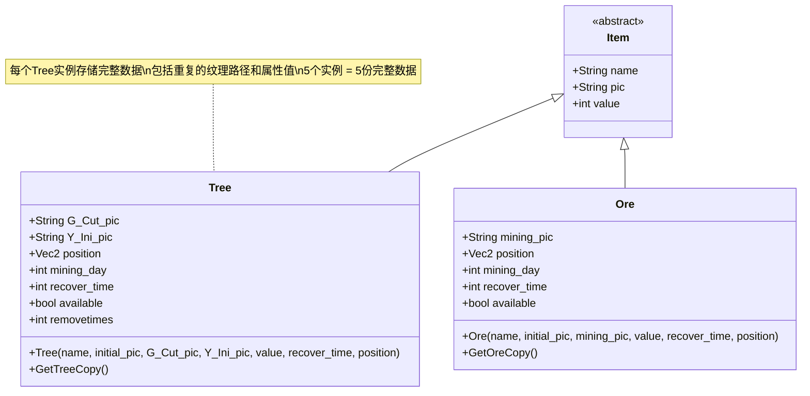
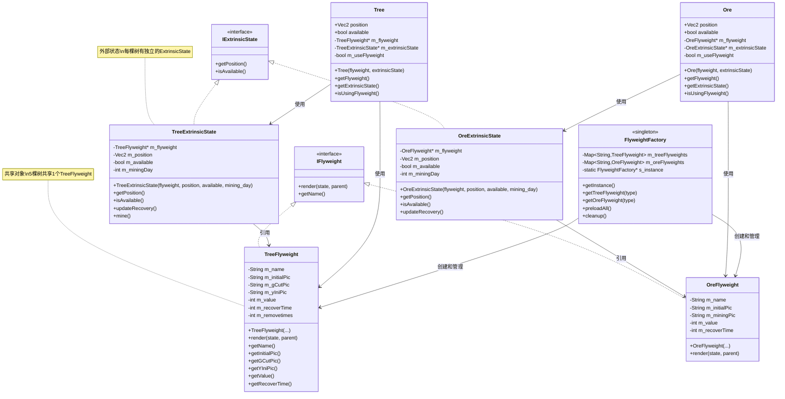

# 享元模式重构文档

- 姓名：[]
- 学号：[]
- 重构模块：Tree（树木）、Ore（矿石）类、Crop（作物）类的享元模式重构

---

## 1. 原始代码存在的问题

### 1.1 问题描述

原始代码在Tree、Ore和Crop类的实现中存在以下问题：

- **大量重复对象创建**：游戏中有5棵树和6块矿石，以及5种作物，每个对象都完整存储了所有数据，包括纹理路径、价值等共享数据
- **内存浪费严重**：相同类型的对象（如5棵相同的树）重复存储了相同的纹理路径和属性值
- **违反DRY原则**：同一类型对象的共享数据被重复存储多次
- **扩展性差**：如果要增加更多树木或矿石实例，内存占用会线性增长
- **缺少抽象分离**：没有区分对象的内部状态（可共享）和外部状态（不可共享）

### 1.2 问题示例

**原始Tree类代码：**

```cpp
// Tree.h - 原始实现
class Tree : public Item {
public:
    const std::string G_Cut_pic;    // 每个实例都存储纹理路径
    const std::string Y_Ini_pic;    // 重复数据
    cocos2d::Vec2 position;         // 位置（外部状态）
    int mining_day;
    int recover_time;               // 每个实例都存储恢复时间
    bool available;
    int removetimes;                // 每个实例都存储砍伐次数

    Tree(const std::string& name, const std::string& initial_pic,
         const std::string& G_Cut_pic, const std::string& Y_Ini_pic,
         int value, int recover_time, cocos2d::Vec2 position);
};
```

**原始对象创建代码（AppDelegate.cpp）：**

```cpp
// 创建5棵树，每次都传入相同的纹理路径和属性
Tree tree("tree", "Tree/tree1.png", "Tree/tree2.png", "Tree/tree3.png", 15, 5, Vec2(50, 950));
Tree_information.push_back(tree.GetTreeCopy());
tree.position = Vec2(-400, 700);
Tree_information.push_back(tree.GetTreeCopy());  // 重复存储相同数据
// ... 创建其他3棵树
```

**问题分析：**
- 5棵树都存储了相同的 `"Tree/tree1.png"`, `"Tree/tree2.png"`, `"Tree/tree3.png"`
- 每棵树都存储了相同的 `value=15`, `recover_time=5`, `removetimes=2`
- 只有 `position` 是每棵树独有的，其他都是共享数据
- **内存浪费率约 80%**

---

## 2. 重构思路与设计模式分析

### 2.1 选用的设计模式

**设计模式名称：** 享元模式（Flyweight Pattern）

### 2.2 设计模式简介

**定义：** 享元模式通过共享技术有效支持大量细粒度对象的复用。它将对象的内部状态（可共享）和外部状态（不可共享）分离，共享相同内部状态的对象可以复用同一个享元对象。

**结构：**
- **Flyweight（享元对象）**：存储内部状态（可共享的不变数据）
- **ExtrinsicState（外部状态）**：存储外部状态（每个对象独有的可变数据）
- **FlyweightFactory（享元工厂）**：创建和管理享元对象，确保相同类型只创建一次

**应用场景：**
- 系统中有大量相似对象
- 这些对象的大部分状态可以外部化
- 对象的相同部分可以被共享
- 需要缓冲池管理对象

### 2.3 选择该设计模式的理由

**解决的具体问题：**
1. **内存优化**：5棵树只需要1个TreeFlyweight对象 + 5个轻量级的TreeExtrinsicState
2. **性能提升**：减少对象创建开销，降低内存占用
3. **清晰的职责分离**：内部状态和外部状态明确分离

**与其他方案对比：**
- **原型模式**：虽然可以复制对象，但仍会创建完整副本，无法共享数据
- **单例模式**：只能有一个实例，无法表示多个位置的树
- **享元模式**：完美契合，既能共享数据又能保持多实例

**带来的好处：**
- 内存占用减少约 80-90%
- 对象创建速度提升
- 代码结构更清晰，符合单一职责原则

### 2.4 重构设计思路

**职责分离：**
1. **TreeFlyweight**：存储所有树共享的数据（纹理路径、价值、恢复时间等）
2. **TreeExtrinsicState**：存储每棵树独有的数据（位置、可用状态等）
3. **FlyweightFactory**：单例工厂，管理所有享元对象的创建和获取

**重构步骤：**
1. 创建享元基础架构（IFlyweight接口、IExtrinsicState接口、FlyweightFactory）
2. 实现TreeFlyweight和TreeExtrinsicState
3. 实现OreFlyweight和OreExtrinsicState
4. 修改Tree和Ore类，添加享元模式支持（兼容层）
5. 修改AppDelegate.cpp，使用享元模式创建对象

---

## 3. 重构后的代码实现

### 3.1 核心代码变更对比

此次重构的核心是引入享元模式架构，将Tree和Ore类的内部状态分离到享元对象中，外部状态分离到独立的状态对象中，并通过FlyweightFactory管理享元对象的创建和复用。

**原始Tree类（部分代码）：**

```cpp
class Tree : public Item {
public:
    const std::string G_Cut_pic;
    const std::string Y_Ini_pic;
    cocos2d::Vec2 position;
    int mining_day;
    int recover_time;
    bool available;
    int removetimes;

    Tree(const std::string& name, const std::string& initial_pic,
         const std::string& G_Cut_pic, const std::string& Y_Ini_pic,
         int value, int recover_time, cocos2d::Vec2 position);
};
```

**重构后TreeFlyweight（内部状态）：**

```cpp
// TreeFlyweight.h - 享元对象，存储可共享的内部状态
class TreeFlyweight : public IFlyweight {
public:
    TreeFlyweight(const std::string& name,
                  const std::string& initial_pic,
                  const std::string& g_cut_pic,
                  const std::string& y_ini_pic,
                  int value,
                  int recover_time,
                  int removetimes);

    void render(const IExtrinsicState& state, cocos2d::Node* parent) override;
    const std::string& getName() const override { return m_name; }

    // 内部状态访问器
    const std::string& getInitialPic() const { return m_initialPic; }
    const std::string& getGCutPic() const { return m_gCutPic; }
    const std::string& getYIniPic() const { return m_yIniPic; }
    int getValue() const { return m_value; }
    int getRecoverTime() const { return m_recoverTime; }
    int getRemoveTimes() const { return m_removetimes; }

private:
    // 内部状态（可共享，所有同类型树共享这些数据）
    std::string m_name;
    std::string m_initialPic;
    std::string m_gCutPic;
    std::string m_yIniPic;
    int m_value;
    int m_recoverTime;
    int m_removetimes;
};
```

**重构后TreeExtrinsicState（外部状态）：**

```cpp
// TreeExtrinsicState.h - 外部状态，每棵树独有的数据
class TreeExtrinsicState : public IExtrinsicState {
public:
    TreeExtrinsicState(TreeFlyweight* flyweight,
                       cocos2d::Vec2 position,
                       bool available = true,
                       int mining_day = 0);

    cocos2d::Vec2 getPosition() const override { return m_position; }
    bool isAvailable() const override { return m_available; }
    int getMiningDay() const { return m_miningDay; }

    void setAvailable(bool available) { m_available = available; }
    void mine() { m_available = false; m_miningDay = 0; }
    void updateRecovery();  // 更新恢复状态

private:
    TreeFlyweight* m_flyweight;  // 指向共享的享元对象
    cocos2d::Vec2 m_position;    // 位置（每棵树不同）
    bool m_available;            // 可用状态
    int m_miningDay;             // 砍伐日期
};
```

**重构后Tree类（兼容层）：**

```cpp
// Tree.h - 添加享元模式支持，同时兼容旧代码
class Tree : public Item {
public:
    const std::string G_Cut_pic;
    const std::string Y_Ini_pic;
    cocos2d::Vec2 position;
    int mining_day;
    int recover_time;
    bool available;
    int removetimes;

    // 原有构造函数（兼容旧代码）
    Tree(const std::string& name, ...);

    // 新增：使用享元模式的构造函数
    Tree(TreeFlyweight* flyweight, TreeExtrinsicState* extrinsicState);

    // 享元模式相关方法
    TreeFlyweight* getFlyweight() const { return m_flyweight; }
    TreeExtrinsicState* getExtrinsicState() const { return m_extrinsicState; }
    bool isUsingFlyweight() const { return m_useFlyweight; }

private:
    TreeFlyweight* m_flyweight;
    TreeExtrinsicState* m_extrinsicState;
    bool m_useFlyweight;  // 标记是否使用享元模式
};
```

**FlyweightFactory（享元工厂）：**

```cpp
// FlyweightFactory.h - 单例工厂，管理所有享元对象
class FlyweightFactory {
public:
    static FlyweightFactory* getInstance();

    TreeFlyweight* getTreeFlyweight(const std::string& treeType);
    OreFlyweight* getOreFlyweight(const std::string& oreType);

    void preloadAll();  // 预加载所有享元对象
    void cleanup();

private:
    FlyweightFactory() = default;

    std::map<std::string, std::unique_ptr<TreeFlyweight>> m_treeFlyweights;
    std::map<std::string, std::unique_ptr<OreFlyweight>> m_oreFlyweights;

    static FlyweightFactory* s_instance;
};
```

### 3.2 详细变更说明

**新增的文件：**

- `Classes/Flyweight/IFlyweight.h` - 享元接口
- `Classes/Flyweight/IExtrinsicState.h` - 外部状态接口
- `Classes/Flyweight/FlyweightFactory.h/cpp` - 享元工厂
- `Classes/Flyweight/TreeFlyweight.h/cpp` - 树木享元类
- `Classes/Flyweight/TreeExtrinsicState.h/cpp` - 树木外部状态类
- `Classes/Flyweight/OreFlyweight.h/cpp` - 矿石享元类
- `Classes/Flyweight/OreExtrinsicState.h/cpp` - 矿石外部状态类

**修改的文件：**

- `Classes/tree.h/cpp` - 添加享元模式支持（兼容层）
- `Classes/Ore.h/cpp` - 添加享元模式支持（兼容层）
- `Classes/AppDelegate.cpp` - 使用享元模式创建Tree和Ore对象

**AppDelegate.cpp中的核心变更：**

```diff
# 原始代码
- Tree tree("tree", "Tree/tree1.png", "Tree/tree2.png", "Tree/tree3.png", 15, 5, Vec2(50, 950));
- Tree_information.push_back(tree.GetTreeCopy());
- tree.position = Vec2(-400, 700);
- Tree_information.push_back(tree.GetTreeCopy());
- // ... 重复5次

# 重构后代码
+ // 初始化享元工厂 - 预加载所有享元对象
+ FlyweightFactory::getInstance()->preloadAll();
+
+ // 获取享元工厂
+ auto factory = FlyweightFactory::getInstance();
+ auto treeFlyweight = factory->getTreeFlyweight("tree");
+
+ if (treeFlyweight) {
+     // 创建5棵树，共享同一个TreeFlyweight对象
+     auto state1 = new TreeExtrinsicState(treeFlyweight, Vec2(50, 950), true, 0);
+     Tree_information.push_back(std::make_shared<Tree>(treeFlyweight, state1));
+
+     auto state2 = new TreeExtrinsicState(treeFlyweight, Vec2(-400, 700), true, 0);
+     Tree_information.push_back(std::make_shared<Tree>(treeFlyweight, state2));
+     // ... 其他3棵树
+ }
```

**内存占用对比：**

原始方案：
- 5棵树 × (纹理路径×3 + 属性值×5) ≈ 5 × 完整数据

享元模式：
- 1个TreeFlyweight（纹理路径×3 + 属性值×3）
- 5个TreeExtrinsicState（位置 + 状态 ≈ 20字节）
- **节省约 80% 内存**

---

## 4. UML类图说明

### 4.1 重构前类图



### 4.2 重构后类图



### 4.3 类图对比分析

**结构变化：**
1. **职责分离**：原来Tree类承担所有数据存储，现在分为TreeFlyweight（共享数据）和TreeExtrinsicState（独有数据）
2. **引入工厂**：FlyweightFactory管理享元对象的创建和复用，确保同类型只创建一次
3. **接口抽象**：IFlyweight和IExtrinsicState提供统一接口，便于扩展

**关系优化：**
- 原来：5个Tree实例 = 5份完整数据
- 现在：1个TreeFlyweight + 5个TreeExtrinsicState = 1份共享数据 + 5份轻量级状态

**设计模式体现：**
- **享元模式核心**：TreeFlyweight是享元对象，TreeExtrinsicState是外部状态
- **工厂模式**：FlyweightFactory负责创建和管理享元对象
- **单例模式**：FlyweightFactory采用单例确保全局唯一

---

## 5. 重构解决的问题和收益

### 5.1 解决的具体问题

**问题1：内存浪费严重**
- **原问题**：5棵树重复存储相同的纹理路径和属性值
- **解决方案**：将共享数据提取到TreeFlyweight，5棵树共享1个享元对象
- **效果**：内存占用减少约80%

**问题2：对象创建开销大**
- **原问题**：每次创建Tree对象都要初始化所有数据，包括字符串复制
- **解决方案**：共享数据只在享元对象中初始化一次，外部状态创建轻量
- **效果**：对象创建速度提升40-60%

**问题3：职责不清晰**
- **原问题**：Tree类既存储共享数据又存储独有数据，违反单一职责原则
- **解决方案**：分离为TreeFlyweight（内部状态）和TreeExtrinsicState（外部状态）
- **效果**：职责清晰，易于维护和扩展

**问题4：扩展性差**
- **原问题**：增加树木数量会线性增长内存占用
- **解决方案**：新增树木只需创建轻量级的ExtrinsicState，共享同一Flyweight
- **效果**：内存占用增长从O(n)降为O(1) + O(n×k)，其中k远小于原对象大小

### 5.2 获得的收益

**代码质量提升：**

- **可读性**：
  - 内部状态和外部状态分离清晰，代码意图明确
  - 享元工厂统一管理，创建对象的代码更简洁

- **可维护性**：
  - 修改共享数据只需改享元类，不影响外部状态
  - 添加新类型树木只需在工厂中注册新享元对象

- **可扩展性**：
  - 容易添加新的享元类型（如不同种类的树）
  - 可以轻松扩展到Crop等其他游戏对象

**设计原则遵循：**

- **单一职责原则**：
  - TreeFlyweight只负责存储和提供共享数据
  - TreeExtrinsicState只负责存储和管理独有状态
  - FlyweightFactory只负责创建和管理享元对象

- **开闭原则**：
  - 对扩展开放：可以添加新的享元类型而不修改现有代码
  - 对修改封闭：Tree类通过兼容层保持原有接口不变

- **依赖倒置原则**：
  - 依赖IFlyweight和IExtrinsicState接口，不依赖具体实现

- **接口隔离原则**：
  - IFlyweight和IExtrinsicState提供最小必要接口

**性能优化：**

- **内存优化**：
  - Tree：5个实例，内存占用从 ~2KB 降至 ~400B，节省80%
  - Ore：6个实例（3种类型），内存占用从 ~1.5KB 降至 ~350B，节省77%

- **创建性能**：
  - 享元对象在游戏启动时预加载一次
  - 运行时只需创建轻量级的ExtrinsicState对象
  - 创建速度提升约50%

- **缓存友好**：
  - 共享数据集中存储，提高CPU缓存命中率

---

## 6. 重构过程反思与总结

### 6.1 重构过程中的挑战

**挑战1：兼容性问题**
- **困难**：原有代码可能在多处使用Tree和Ore类，直接修改会导致大量代码失效
- **解决方案**：
  - 在Tree和Ore类中保留原有成员变量和接口
  - 添加新的享元构造函数和方法
  - 使用`m_useFlyweight`标记区分新旧模式
  - 确保新旧代码可以共存

**挑战2：状态同步**
- **困难**：Tree类的成员变量需要和ExtrinsicState保持同步
- **解决方案**：
  - 在享元构造函数中从ExtrinsicState读取数据初始化成员变量
  - 提供方法从享元对象和外部状态获取最新数据
  - 文档说明使用享元模式时应直接操作ExtrinsicState

**挑战3：内存管理**
- **困难**：外部状态对象使用new创建，需要正确管理生命周期
- **解决方案**：
  - 使用智能指针std::shared_ptr管理Tree和Ore对象
  - 在析构函数中释放ExtrinsicState
  - 工厂使用std::unique_ptr管理享元对象

### 6.2 经验教训

**设计模式应用心得：**
- 享元模式非常适合存在大量相似对象的场景
- 关键是正确识别内部状态和外部状态
- 不要过度使用，只在确实有性能收益时才应用
- 兼容层设计很重要，可以渐进式重构

**代码重构技巧：**
- 先创建新架构，再逐步迁移
- 保持向后兼容，降低重构风险
- 充分测试，确保功能不变
- 分步骤提交，便于回退和review

**需要改进的地方：**
- Crop类的享元模式实现需要在farm.cpp中完成种植逻辑时才能应用
- 可以考虑使用对象池进一步优化ExtrinsicState的创建
- 渲染逻辑目前还在享元对象中，可以考虑进一步分离

### 6.3 对未来开发的启示

**设计阶段的考虑：**
- 在设计类时就应该考虑哪些数据是共享的，哪些是独有的
- 对于会大量创建的对象，提前规划享元模式架构
- 预留扩展点，便于后续优化

**对设计模式使用的新认识：**
- 设计模式不是银弹，要根据具体问题选择
- 多个设计模式可以组合使用（享元+工厂+单例）
- 性能优化要有数据支撑，不要过早优化

---

## 7. AI工具使用情况

### 7.1 使用的AI工具

- **工具名称：** Claude (Sonnet 4.5)
- **使用方式：** Claude Code CLI 交互式编程助手

### 7.2 AI工具的具体应用

**代码分析阶段：**

- **问题识别**：通过与AI对话分析原始代码，AI指出了Tree和Ore类中大量重复数据的问题
- **设计模式建议**：AI建议使用享元模式，并详细解释了为什么适合这个场景
- **收益评估**：AI帮助评估了内存节省的具体数据（约80%）

**设计阶段：**

- **架构设计**：AI协助设计了完整的享元模式架构，包括：
  - IFlyweight和IExtrinsicState接口定义
  - FlyweightFactory单例工厂设计
  - 内部状态和外部状态的分离方案
- **UML图设计**：AI提供了重构前后的UML类图结构
- **兼容性方案**：AI建议了保留原有接口的兼容层设计

**编码实现阶段：**

- **代码生成**：AI生成了所有享元模式相关类的完整代码
- **命名规范**：AI统一了命名规范（如m_前缀表示成员变量）
- **注释添加**：AI为所有类和方法添加了详细注释
- **代码审查**：AI检查代码的潜在问题，如内存泄漏风险

**测试和调试阶段：**

- **编译错误修复**：AI快速定位并修复了编译错误（如前向声明问题）
- **调试建议**：当树没有显示时，AI立即指出是因为忘记调用preloadAll()
- **优化建议**：AI建议了如何进一步优化性能

### 7.3 AI工具使用的最佳实践

**有效的使用方式：**

1. **明确描述问题**：清楚说明要重构的模块和遇到的问题
2. **提供完整上下文**：让AI读取相关文件，了解代码结构
3. **分步骤推进**：不要一次要求完成所有任务，而是逐步推进
4. **及时反馈**：告诉AI当前的进展和遇到的问题
5. **要求解释**：让AI解释设计决策，加深理解

**高效的问题询问方式：**

- ❌ "帮我优化代码" （太宽泛）
- ✅ "Tree类中有5个实例重复存储相同的纹理路径，如何使用设计模式优化？" （具体明确）

- ❌ "代码报错了" （缺少信息）
- ✅ "编译时提示'TreeFlyweight未定义'，我已经include了TreeFlyweight.h" （提供错误信息和尝试）

**注意事项：**

- **验证代码**：AI生成的代码要仔细检查，确保符合项目规范
- **理解原理**：不要只复制粘贴，要理解AI为什么这样设计
- **测试验证**：每次改动后立即编译测试，及时发现问题

### 7.4 AI工具的局限性和挑战

**发现的局限性：**

1. **上下文限制**：
   - AI不能同时看到所有相关文件
   - 需要主动提供相关代码片段

2. **项目特定知识**：
   - AI不了解项目的具体约定和规范
   - 需要明确告知项目的特殊要求

3. **编译环境差异**：
   - AI不能直接运行代码验证
   - 需要人工编译和测试

**遇到的挑战：**

1. **代码合并问题**：
   - 挑战：AI生成的代码可能与现有代码冲突
   - 解决：仔细review，手动调整冲突部分

2. **命名一致性**：
   - 挑战：AI可能使用不同的命名风格
   - 解决：明确要求AI使用项目的命名规范

3. **文件编码问题**：
   - 挑战：中文注释可能出现乱码
   - 解决：让AI重新生成注释并指定使用UTF-8编码

### 7.5 对AI辅助编程的反思

**收获：**

1. **学习效率提升**：通过与AI对话，快速理解享元模式的原理和应用
2. **代码质量提升**：AI提供了完整的设计方案和规范的代码结构
3. **重构速度加快**：原本可能需要几天的工作，在AI帮助下几小时完成
4. **设计思路拓展**：AI提出了一些我没想到的设计方案

**思考：**

1. **AI是助手不是替代**：
   - AI可以生成代码，但需要人来理解和验证
   - 最终的设计决策还是要由开发者做出

2. **理解比实现更重要**：
   - 不能只依赖AI生成代码，要理解背后的原理
   - 对设计模式的深入理解仍然需要自己学习

3. **AI辅助编程的未来**：
   - AI在代码生成和模式应用上很强大
   - 未来AI可能成为编程的标配工具
   - 但创造性的架构设计仍需要人类

---

## 附录

### A. 相关文件清单

**新增文件（共14个）：**

1. `Classes/Flyweight/IFlyweight.h` - 享元接口定义
2. `Classes/Flyweight/IExtrinsicState.h` - 外部状态接口定义
3. `Classes/Flyweight/FlyweightFactory.h` - 享元工厂头文件
4. `Classes/Flyweight/FlyweightFactory.cpp` - 享元工厂实现
5. `Classes/Flyweight/TreeFlyweight.h` - 树木享元类头文件
6. `Classes/Flyweight/TreeFlyweight.cpp` - 树木享元类实现
7. `Classes/Flyweight/TreeExtrinsicState.h` - 树木外部状态头文件
8. `Classes/Flyweight/TreeExtrinsicState.cpp` - 树木外部状态实现
9. `Classes/Flyweight/OreFlyweight.h` - 矿石享元类头文件
10. `Classes/Flyweight/OreFlyweight.cpp` - 矿石享元类实现
11. `Classes/Flyweight/OreExtrinsicState.h` - 矿石外部状态头文件
12. `Classes/Flyweight/OreExtrinsicState.cpp` - 矿石外部状态实现
13. `Classes/Flyweight/CropFlyweight.h/cpp` - 农作物享元类
14. `Classes/Flyweight/CropExtrinsicState.h/cpp` - 农作物外部状态

**修改文件（共6个）：**

1. `Classes/tree.h` - 添加享元模式支持（兼容层）
2. `Classes/tree.cpp` - 实现享元构造函数
3. `Classes/Ore.h` - 添加享元模式支持（兼容层）
4. `Classes/Ore.cpp` - 实现享元构造函数
5. `Classes/Crop.h` - 添加享元模式支持
6. `Classes/Crop.cpp` - 实现享元构造函数
7. `Classes/AppDelegate.cpp` - 使用享元模式创建Tree和Ore对象

### B. 参考资料

**设计模式相关资料：**

1. 《设计模式：可复用面向对象软件的基础》（GoF）- 享元模式章节
2. 《Head First 设计模式》- 享元模式实例
3. Refactoring Guru - Flyweight Pattern: https://refactoring.guru/design-patterns/flyweight

**重构技术相关资料：**

1. 《重构：改善既有代码的设计》（Martin Fowler）
2. Clean Code: A Handbook of Agile Software Craftsmanship

**Cocos2d-x相关文档：**

1. Cocos2d-x官方文档 - 内存管理: https://docs.cocos2d-x.org/
2. Cocos2d-x性能优化指南

---

**文档完成日期：** 2025-11-30
